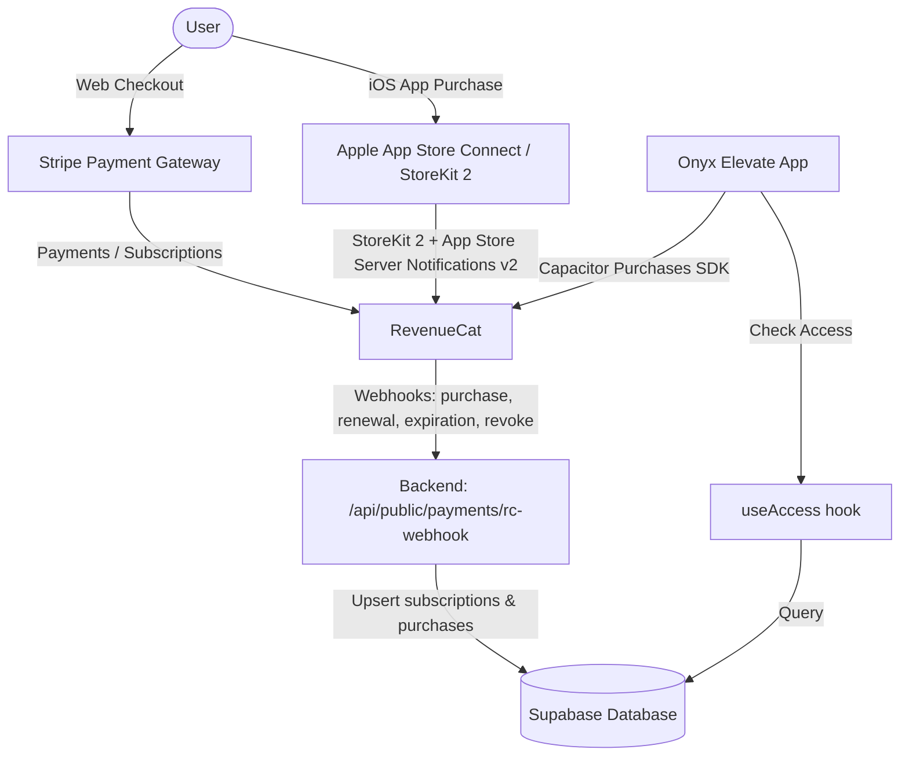

# Onyx Elevate — Subscription & Payment System Implementation Plan

This document outlines the step-by-step implementation plan to configure the Onyx Elevate payment system as requested by the client, supporting both **Stripe (Web)** and **Apple App Store Connect / StoreKit 2 (iOS)**, unified through **RevenueCat**.

---

## 🏗️ Architecture Overview



---

## 📊 Pricing & Product Configuration Matrix

### 1. Stripe (Web) Configuration

Create the following products and prices in your Stripe Dashboard. Use the exact **Lookup Keys** listed below so the app can fetch them dynamically based on the user's localized storefront.

| Region / Currency | Product / Option | Price | Billing / Type | Stripe Lookup Key |
| :--- | :--- | :--- | :--- | :--- |
| **US (USD)** | Monthly Subscription | **$12.99 / mo** | Auto-renewing subscription | `all_access_monthly_usd` |
| | Monthly (Intro Offer) | **$6.99 / 1st mo** | Promo: 1st month at $6.99, then $12.99 | Configure as Coupon / Discount |
| | Yearly Subscription | **$89.00 / yr** | Auto-renewing subscription | `all_access_yearly_usd` |
| | Yearly (3x Split) | **3 × $30.00** | Split payment subscription (Web Only) | `all_access_yearly_3x_usd` |
| | Lifetime / All Access | **$129.00** | Non-consumable one-time purchase | `all_access_lifetime_usd` |
| **BR (BRL)** | Monthly Subscription | **R$ 29,99 / mês** | Auto-renewing subscription | `all_access_monthly_brl` |
| | Monthly (Intro Offer) | **R$ 14,99 / 1st mo** | Promo: 1st month at R$ 14,99, then R$ 29,99 | Configure as Coupon / Discount |
| | Yearly Subscription | **R$ 499,00 / ano** | Auto-renewing subscription | `all_access_yearly_brl` |
| | Yearly (3x Split) | **3 × R$ 167,00** | Split payment subscription (Web Only) | `all_access_yearly_3x_brl` |
| | Lifetime / All Access | **R$ 799,00** | Non-consumable one-time purchase | `all_access_lifetime_brl` |
| **ES (EUR)** | Monthly Subscription | **€11,99 / mes** | Auto-renewing subscription | `all_access_monthly_eur` |
| | Monthly (Intro Offer) | **€5,99 / 1st mo** | Promo: 1st month at €5,99, then €11,99 | Configure as Coupon / Discount |
| | Yearly Subscription | **€79,00 / año** | Auto-renewing subscription | `all_access_yearly_eur` |
| | Yearly (3x Split) | **3 × €27,00** | Split payment subscription (Web Only) | `all_access_yearly_3x_eur` |
| | Lifetime / All Access | **€119,00** | Non-consumable one-time purchase | `all_access_lifetime_eur` |
| **NO (NOK)** | Monthly Subscription | **99 kr / måned** | Auto-renewing subscription | `all_access_monthly_nok` |
| | Monthly (Intro Offer) | **49 kr / 1st mo** | Promo: 1st month at 49 kr, then 99 kr | Configure as Coupon / Discount |
| | Yearly Subscription | **899 kr / år** | Auto-renewing subscription | `all_access_yearly_nok` |
| | Yearly (3x Split) | **3 × 300 kr** | Split payment subscription (Web Only) | `all_access_yearly_3x_nok` |
| | Lifetime / All Access | **1299 kr** | Non-consumable one-time purchase | `all_access_lifetime_nok` |

> [!TIP]
> Configure the **Monthly Intro Offer** as a Stripe Coupon applying a discount for the first month (e.g. `onyx_first_month_50` or custom coupons) to match the required intro pricing natively, or define it as an introductory price option on the product.

---

### 2. Apple App Store Connect Configuration

Create **ONE** subscription group called `all_access` in App Store Connect. Apple only allows one active subscription per group, facilitating seamless upgrades/downgrades.

- **Product ID Prefix:** `com.onyxelevate.app.` (relying on appId `com.onyxelevate.app`)

| Product Name | App Store Product ID | Type | Features & Offers |
| :--- | :--- | :--- | :--- |
| **Monthly Subscription** | `com.onyxelevate.app.all_access_monthly` | Auto-renewable Subscription | Configure **Introductory Offer**: *Pay as you go - 1 period at intro price* (closest tiered pricing matching $6.99, R$ 14,99, €5,99, 49 kr) |
| **Yearly Subscription** | `com.onyxelevate.app.all_access_yearly` | Auto-renewable Subscription | Configure **Introductory Offer**: *Free trial* (1-week free trial). Apple-only promo; optionally mirror on Stripe Yearly for web parity. |
| **Lifetime Access** | `com.onyxelevate.app.all_access_lifetime` | Non-Consumable In-App Purchase | One-time charge (closest tiered pricing matching $129, R$ 799, €119, 1299 kr). This is NOT a subscription. |

> [!WARNING]
> **Yearly 3x split is NOT supported by Apple.** You must hide the Yearly 3x split payment option on iOS/mobile screens, displaying only the Monthly, Yearly, and Lifetime choices.

---

## 🛠️ Step-by-Step Implementation Guide

### Step 1: Update Supabase Database Schema

To support unified payments, we must update the `subscriptions` and `purchases` tables to specify the payment provider (`stripe` or `apple`).

Create a new migration (e.g., `20260715180000_add_provider_to_payments.sql`):

```sql
-- 1) Alter public.subscriptions to support Apple subscriptions
ALTER TABLE public.subscriptions ADD COLUMN IF NOT EXISTS provider TEXT NOT NULL DEFAULT 'stripe' CHECK (provider IN ('stripe', 'apple'));
ALTER TABLE public.subscriptions ALTER COLUMN stripe_subscription_id DROP NOT NULL;
ALTER TABLE public.subscriptions ALTER COLUMN stripe_customer_id DROP NOT NULL;

-- 2) Alter public.purchases to support Apple one-time purchases
ALTER TABLE public.purchases ADD COLUMN IF NOT EXISTS provider TEXT NOT NULL DEFAULT 'stripe' CHECK (provider IN ('stripe', 'apple'));
```

---

### Step 2: Handle Server-Side Verification for iOS Purchases

Implement an API route to handle StoreKit 2 transaction verification and App Store Server Notifications v2 to keep local access synced in the database.

1. **Transaction Verification (Server-Side):**
   Create an endpoint `/api/public/payments/apple-verify` or a server function to receive the transaction JWS from the iOS client, verify it with Apple's Root Certificates, and upsert a purchase/subscription:

   ```typescript
   // Example logic for Apple purchase verification
   export async function verifyAppleTransaction(signedTransaction: string, userId: string) {
     // 1. Verify JWS signature using StoreKit 2 server utilities
     // 2. Decode the payload (extract productId, originalTransactionId, expiresDate, etc.)
     // 3. Match productId to our entitlement groups
     // 4. Update the DB:
     //    - If non-consumables (Lifetime): upsert into purchases table (provider: 'apple')
     //    - If subscription (Monthly/Yearly): upsert into subscriptions table (provider: 'apple')
   }
   ```

2. **App Store Server Notifications v2:**
   Create `/api/public/payments/apple-webhook` to receive real-time notifications (e.g., `DID_RENEW`, `EXPIRED`, `REVOKE`, `DID_CHANGE_RENEWAL_STATUS`) from Apple to keep subscription states identical to Stripe.

---

### Step 3: Configure Frontend Pricing Constants

Ensure the pricing utility [src/lib/pricing.ts](file:///Users/anik/Desktop/Onyx%20Elevate/src/lib/pricing.ts) matches the requirements perfectly:

```typescript
// Confirm prices array aligns with the configurations:
const PRICES: Record<PriceKey, Record<string, string>> = {
  monthly: {
    en: "$12.99",
    "pt-BR": "R$ 29,99",
    es: "€11.99",
    no: "99 kr",
  },
  monthlyIntro: {
    en: "$6.99",
    "pt-BR": "R$ 14,99",
    es: "€5.99",
    no: "49 kr",
  },
  yearly: {
    en: "$89",
    "pt-BR": "R$ 499",
    es: "€79",
    no: "899 kr",
  },
  yearly3x: {
    en: "3× $30",
    "pt-BR": "3× R$ 167",
    es: "3× €27",
    no: "3× 300 kr",
  },
  lifetime: {
    en: "$129",
    "pt-BR": "R$ 799",
    es: "€119",
    no: "1299 kr",
  },
  // ...
};
```

---

### Step 4: Hide Split Payments on iOS

In the paywall or checkout screens (e.g. within [src/routes/app.tsx](file:///Users/anik/Desktop/Onyx%20Elevate/src/routes/app.tsx) or pricing component page), determine if the platform is iOS (using Capacitor's `Capacitor.getPlatform()`) and dynamically exclude the `yearly3x` split offer.

```typescript
import { Capacitor } from '@capacitor/core';

const isIOS = Capacitor.getPlatform() === 'ios';

// In your rendering loop:
const options = [
  { id: 'monthly', title: 'Monthly' },
  { id: 'yearly', title: 'Yearly' },
  // Filter out the 3x split on iOS
  ...(!isIOS ? [{ id: 'yearly3x', title: 'Yearly (3x Split)' }] : []),
  { id: 'lifetime', title: 'Lifetime' }
];
```

---

### Step 5: Implement In-App Purchases on iOS with RevenueCat (Capacitor)

1. **Install the RevenueCat Capacitor SDK:**
   ```bash
   npm install @revenuecat/purchases-capacitor
   npx cap sync
   ```
2. **Configure at startup** (after the `Capacitor.getPlatform()` check):
   ```typescript
   import { Purchases } from '@revenuecat/purchases-capacitor';

   await Purchases.configure({ apiKey: '<RC_IOS_API_KEY>' });
   await Purchases.logIn(userId); // link to Supabase auth user
   ```
3. **Fetch offerings & products:** RevenueCat pulls the App Store Product IDs (`all_access_monthly`, `all_access_yearly`, `all_access_lifetime`) automatically as `Offerings`. No manual product registration needed.
4. **Execute Purchase Flow:**
   When a user clicks "Subscribe" or "Buy" on iOS:
   - `const { customerInfo } = await Purchases.purchaseStoreProduct(product);`
   - Check `customerInfo.entitlements.all['all_access'].isActive` to unlock access locally.
   - RevenueCat's webhook (Step 2) is the server source of truth; you no longer send raw JWS receipts to your own endpoint.

---

### Step 6: Apply for Apple's Small Business Program

To maximize profit margins, apply for the program before launching:
1. Go to the [Apple Developer Small Business Program Portal](https://developer.apple.com/programs/small-business/).
2. Submit your developer account details.
3. Once approved, the App Store commission drops to **15%** for all subscriptions and in-app purchases (vs the standard 30% year 1 / 15% year 2+ per subscriber). Eligible when annual proceeds are < $1M USD.
